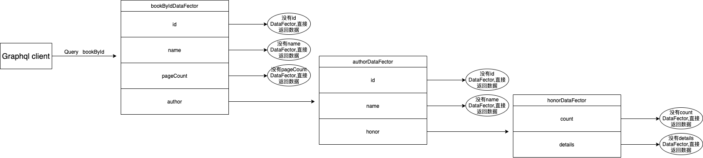

# Graphql springboot

## 项目关键点解释

### 1. 创建 schema 描述文件
We are creating a new file `schema.graphqls` in `src/main/resources` 

### 2. `GraphQLProvider` class
- 创建 `graphql` 实例
- 教程[Getting started with GraphQL Java and Spring Boot](https://www.graphql-java.com/tutorials/getting-started-with-spring-boot/)
说 `The GraphQL Java Spring adapter will use that GraphQL instance to make our schema available via HTTP on the default url /graphql.`但是我访问
`http://localhost:8080/graphql` 并不行，具体看 [README](https://github.com/xichuang-chen/graphql-springboot#overview)
- buildSchema method which creates the GraphQLSchema instance and wires in code to fetch data  
 这个地方其实就是写resolver的地方


## 知识点
### graphql 如何解析数据
graphql server resolve data process:
  

- 从图中可以看出，graphql解析数据时，对于每一属性都先找其dataFetcher(resolver), 如果有其dataFetcher，则进入其dataFetcher继续
解析，如果没有其dataFetcher则结束该字段的解析，直到解析完所有字段
- 并不是说非基本类型都一定要有其dataFetcher(resolver)，可以直接返回结果，如果不返回结果且没有dataFetcher 则返回null;  
  例如，如果没有honor字段dataFetcher，在author中直接返回honor数据也可以，如果author中没有返回honor数据，则honor字段为null;
- 基本类型也可以有dataFetcher(resolver)，如果有相应dataFetcher则进入其dataFetcher处理之后再返回。
### graphql resolver-chain
#### 当解析到某一字段时，其dataFetcher可以拿到其入参数以及其父属性数据
- 当前属性 dataFetcher 可以通过 `DataFetchingEnvironment`的`getArgument`方法获取当前属性的入参  
例如：author的dataFetcher 通过 `dataFetchingEnvironment.getArgument("name")`获取`name`的入参
- 当前属性 dataFetcher 可以通过 `DataFetchingEnvironment`的`getSource`方法获取当前属性的父节点数据，不过getSource方法
出来结果为泛型结构，无法获取某一字段数据，我的做法是先转为JsonObject然后再获取具体属性值  
例如：在author 的 dataFetcher 中通过`dataFetchingEnvironment.getSource()`方法获取父节点数据, 使用json格式化之后为  
    ```json
    {
      "pageCount":35,
      "name":"cxc2",
      "id":1024
    }
    ```  
    为何为父节点，因为现在已经进入author: Author dataFetcher，author父亲为Book, Book 拥有这些属性（来自apollo中graphql说法）
- apollo graphql resolver-chain 参考链接: [resolver chains](https://www.apollographql.com/docs/apollo-server/data/resolvers/#resolver-chains)  
虽然java不用apollo，也可以了解一下apollo 如何解释 resolver chains

### graphql 强制类型
- schema中定义的类型加 `!` 则该为强制类型，如果在入参中，则说明查询该入参必须有  
  例如：schema 中 author(name: String!), `name` 为必须传入的参数，而 bookById 中 `id`
可传可省略
```js
type Query {
  bookById(id: ID): [Book]
}
type Book {
  id: ID!
  name: String!
  pageCount: Int
  author(name: String!): Author
}
```
- schema 中 field 类型加 `!` 说明该 field 必须返回非null值，否则就会报错  
  例如 `Book` 中的 `id` 以及 `name`，如果返回值为null，则报错。而其他field可以返回null.